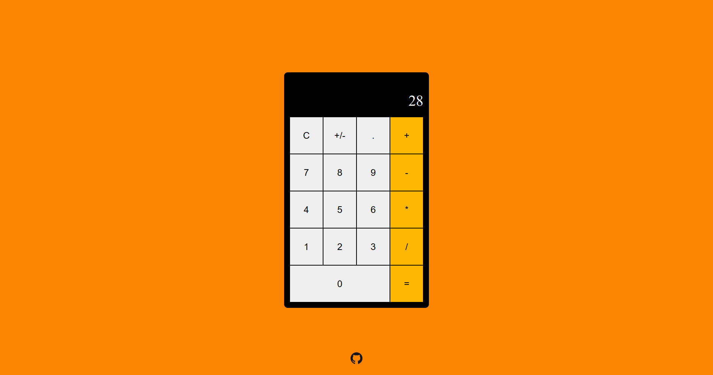

# Calculator

## Preview

## Description
* Basic webpage calculator.

* Operations available:
    * Addition
    * Subtraction
    * Multiplication
    * Division

## Made with
* HTML, CSS and JavaScript.

## Visit website
* [Link](https://jovan-nsty.github.io/calculator/)

## Purpose
* The purpose of this project was to implement the fundamentals of JavaScript, HTML & CSS.

* This project was done following The Odin Project curriculum.